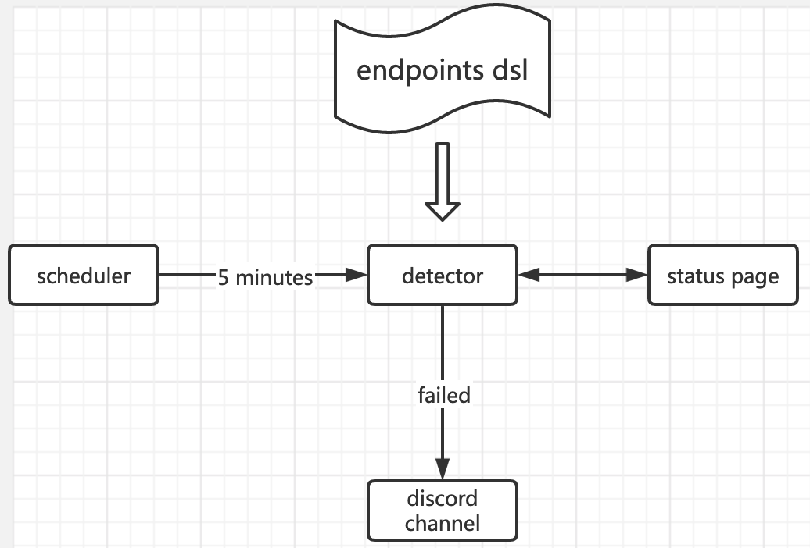

# Services Monitor

A monitor for 3rd services health

## Architecture

## How to add a new endpoint?

1. go to `api/src/service/endpoints.ts`
1. add an item to `endpoints` following the `Endpoint` DSL.
